# 1. 总体设计目标

​        BID解析协议的主要目标是设计一种基于分布式标识符DID规范的、基于星火链网分层架构的、可以实现寻址功能和数字身份功能的、工业互联网和物联网场景下的通用性标识解析协议，BID的注册管理协议会在其他协议中说明，不在本协议讨论范围。

# 2. 总体架构

##     2.1 BID简介

​       星火标识BID（Blockchain-basedIdentifier，简称BID）,是星火·链网的数据载体，也是星火链底层支持的原生地址，同时BID还是加入到分布式身份标识符DID注册表的一个METHOD。BID的组成结构如下：

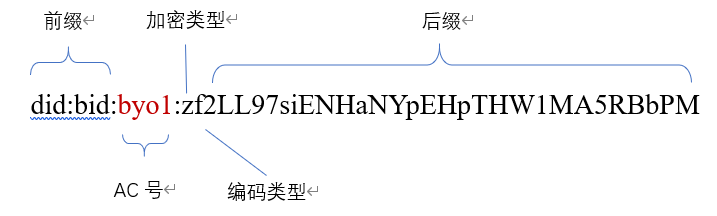

​         did:bid:byo1(AC号) 这样的BID是一类特殊的BID,标识子链解析服务，只有前三个部分，不包含后缀。对应的BID文档里存放子链解析地址。

​         BID标识的ABNF定义如下：

```
  bid-did = "did:bid:" bid-specific-identifier ; 固定的did:bid前缀 
  bid-specific-identifier = 0\*1(acsn ":") suffix / acsn ":" 0\*1(suffix) ; acsn(可选):后缀 或者 acsn:后缀(可选) 
  acsn = 4(ALPHA / DIGIT); 4个字母或数字组合 
  suffix = (22,42)(ALPHA / DIGIT);长度范围22-42的字母或数字组合 
```


##     2.2 架构

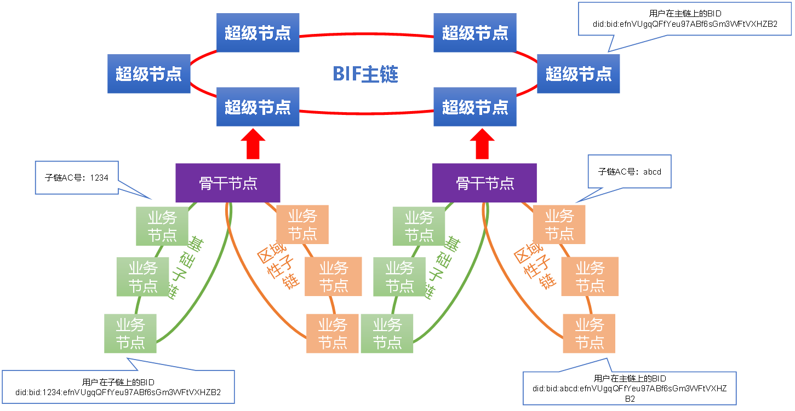

​         BID标识依托于星火链主子链架构，是一个层次化的模型，由主链和子链组成。同一私钥在主链和子链上使用相同的数字身份,只是在子链上的BID多了AC号。主链和子链支持标识解析服务，对外提供解析BID标识的能力。

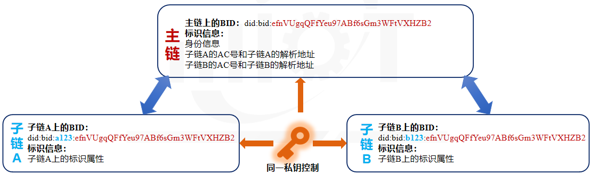

​       主链上主要存储BID在主链的数字身份信息、在主链的基本属性信息、到子链的寻址信息。子链存储在子链的数字身份信息和在子链的基本属性，如与子链所处行业相关的信息、具体标识的设备信息等。

# 3. 协议元数据

   BID的协议元数据为BID文档。BID文档遵循DIDDocument规范，并在之基础上做了一定的扩展。BID文档字段说明如下：

   **1.@context**：必填字段。一组解释JSON-LD文档的规则,遵循DID规范，用于实现不同DID
Document的互操作，必须包含https://www.w3.org/ns/did/v1。

   **2.version**：必填字段。文档的版本号。

   **3.id**：必填字段。文档的BID。

   **4.publicKey**：选填字段。一组公钥，包含id，type，controller,publicKeyHex四个字段，凭证类的BID文档不包含该字段。

   （1）id:公钥的ID。

   （2）type：字符串，代表公钥的加密算法类型，支持Ed25519和SM2两种。

   （3）controller：一个BID,表明此公钥的归属。

   （4）publicKeyHex：公钥的十六进制编码。

   **5. authentication**：必填字段。一组公钥的BID，表名此BID的归属，拥有此公钥对应私钥的一方可以控制和管理此BID文档。

   **6. alsoKnownAs**：选填字段。一组和本BID关联的其他ID, 包括type和id两个字段。

   （1）type:关联标识的类型,取值详见附录**关联标识类型**。

   （2）id:关联的标识。

   **7. extension**：BID扩展字段。包含如下字段：

   （1）recovery：选填字段。一组公钥id, 在authentication私钥泄漏或者丢失的情况下用来恢复对文档的控制权。

   （2）ttl: 必填字段。Time-To-Live，即如果解析使用缓存的话缓存生效的时间，单位秒。

   （3）delegateSign:选填字段。第三方对publicKey的签名，可信解析使用。包括：signer和signatureValue。

　　　&emsp;&emsp;a.）signer ：签名者，这里是一个公钥的id。　　

　　　&emsp;&emsp;b.）signatureValue: 使用相应私钥对publicKey字段的签名。　　

   （4）type: 必填字段。BID文档的属性类型，取值见附录**属性类型**。

   （5）attributes: 必填字段。一组属性，根据文档属性类型不同attributes有不同的字段。

　　　&emsp;&emsp;a.）当type为凭证类型时，属性为可验证声明，结构如下：

| 字段名            | 描述                     |                                                              |
| ----------------- | ------------------------ | ------------------------------------------------------------ |
| issuer            | 必填。发证者BID          |                                                              |
| issuanceDate      | 必填。发证日期           |                                                              |
| effectiveDate     | 必填。生效日期           |                                                              |
| expirationDate    | 必填。失效日期           |                                                              |
| revocationId      | 必填。凭证吊销服务地址ID |                                                              |
| templateId        | 必填。凭证模板ID         |                                                              |
| credentialSubject | 字段名                   | 描述                                                         |
|                   | 必填。id                 | 凭证拥有者的BID                                              |
|                   | 必填。type               | 凭证类型(数字)。详见附录**凭证类型**                         |
|                   | 选填。name               | 被颁发者机构名称                                             |
|                   | 选填。description        | 描述                                                         |
|                   | 选填。content            | 凭证的具体内容，根据模板进行解析                             |
| proof             | 一组签名                 |                                                              |
|                   | 字段                     | 描述                                                         |
|                   | 选填。creator            | proof的创建者，这里是一个公钥的id                            |
|                   | 选填。signatureValue     | 使用相应私钥对attribute内容的签名，其中签名内容为对凭证字段的字符串组合进行签名，格式参考[5章节](#_5.2 签名规则)。 |

　　　&emsp;&emsp;b.）当type为其他属性类型时，属性为如下结构：

| 字段名  | 描述                                        |
| ------- | ------------------------------------------- |
| key     | 属性的关键字                                |
| desc    | 选填。属性描述                              |
| encrypt | 选填。是否加密，0非加密，1加密              |
| format  | 选填。image、text、video、mixture等数据类型 |
| value   | 选填。属性自定义value                       |

   （6）acsns:选填字段。一组子链AC号，只有BID文档类型不是凭证类型且文档是主链上的BID文档才可能有该字段，存放当前BID拥有的所有AC号。
    
   （7）verifiableCredentials:选填字段。凭证列表，包含id和type两个字段。只有BID文档类型不是凭证类型才可能有该字段。

　　　&emsp;&emsp;a.）id: 可验证声明的BID。　

　　　&emsp;&emsp;b.)  type: 凭证类型。详见附录**凭证类型**。　　

   **8.service**：选填字段。一组服务地址，包括id，type，serviceEndpoint三个必填字段。

   （1）id: 服务地址的ID。　　

   （2）type：字符串，代表服务的类型。取值见附录**服务类型**。

   （3）serviceEndpoint：一个URI地址。当type为子链解析服务时， service为以下结构：


| 字段名          | 描述                                                         |
| --------------- | ------------------------------------------------------------ |
| id              | 服务地址的ID                                                 |
| type            | DIDSubResolver                                               |
| version         | 服务支持的BID解析协议版本                                    |
| protocol        | 解析协议支持的传输协议类型, 具体取值见附录**解析服务协议类型** |
| serverType      | 服务地址类型，0为域名形式，1为IP地址形式                     |
| serviceEndpoint | 解析地址的IP或域名                                           |
| port            | serverType为1时有该字段，解析服务的端口号                    |

   **9.created**：必填字段。创建时间。

   **10.updated**：必填字段。上次的更新时间。

   **11.proof**：选填字段。文档所有者对文档内容的签名，包括：creator和signatureValue。

   （1）creator：proof的创建者，这里是一个公钥的id。　　

   （2）signatureValue：使用相应私钥对除proof字段的整个BID文档签名。

# 4. 解析协议

​     BID解析是指获取给定BID的BID文档的过程,所有主链上的超级节点和接入星火链网的子链均需支持BID解析。

## 4.1 架构

### 4.1.1 主链解析架构

​        主链支持解析主链BID文档、子链解析服务地址两类数据。解析主链BID文档分为解析主链普通属性BID文档和解析凭证属性BID文档。解析子链解析服务地址又分为根据带AC号的BID解析子链的解析服务地址和根据子链解析服务BID解析子链的解析服务地址。

1. 解析主链普通属性BID文档

   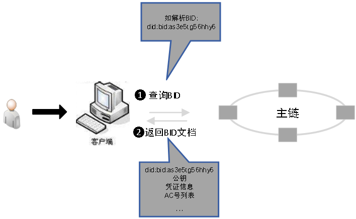

2. 解析主链凭证属性BID文档

   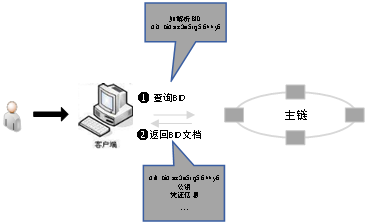

3. 根据带AC号的BID解析子链解析服务地址

   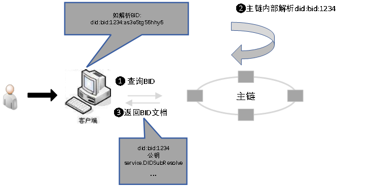

4. 根据子链解析服务BID解析子链的解析服务地址

   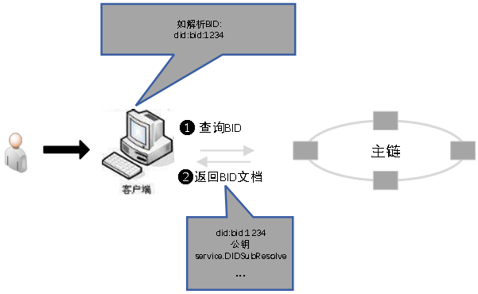

### 4.1.2 子链解析架构

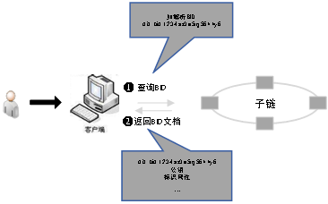

## 4.2 文本解析协议

文本解析协议传输使用HTTP/HTTPS通信协议，使用JSON编码。

### 4.2.1 BID解析

**接口名称**：BID解析接口(GET方法)

**接口说明**：根据BID解析BID内容

**接口地址**：[http://\${url}/\${bid}](http://\${url}/\${bid})，url为解析服务的地址，bid为要解析的BID

**成功返回参数**：解析成功返回BID文档

1.  返回普通BID文档：

| 字段名                                                 | 类型          | 说明                                                  |
|--------------------------------------------------------|---------------|-------------------------------------------------------|
| errorCode                                              | Int           | 见响应码说明                                          |
| data.didDocument                                       | Object        | 解析结果                                              |
| data.didDocument.@context                              | Array         | 一组url数组                                           |
| data.didDocument.version                               | String        | BID文档的版本                                         |
| data.didDocument.id                                    | String        | 解析的BID                                             |
| data.didDocument.publicKey                             | Array(Object) | 公钥                                                  |
| data.didDocument.publicKey.id                          | String        | 公钥id                                                |
| data.didDocument.publicKey.type                        | String        | 公钥算法类型                                          |
| data.didDocument.publicKey.controller                  | String        | 一个BID,表明此公钥的归属                              |
| data.didDocument.publicKey.publicKeyHex                | String        | 十六进制公钥                                          |
| data.didDocument.authentication                        | Array         | 一组公钥id                                            |
| data.didDocument.alsoKnownAs                           | Array(Object) | 关联id                                                |
| data.didDocument.alsoKnownAs.type                      | Int           | 关联id的类型                                          |
| data.didDocument.alsoKnownAs.id                        | String        | 关联id                                                |
| data.didDocument.extension                             | Object        | 扩展字段                                              |
| data.didDocument.extension.recovery                    | Array         | 一组公钥id                                            |
| data.didDocument.extension.ttl                         | Long          | 缓存时间，单位秒                                      |
| data.didDocument.extension.delegateSign                | Object        | 第三方对publicKey的签名，可信解析使用                 |
| data.didDocument.extension.delegateSign.signer         | String        | 签名公钥id                                            |
| data.didDocument.extension.delegateSign.signatureValue | String        | 签名的base58编码                                      |
| data.didDocument.extension.type                        | Int           | 见附录**属性类型**                                    |
| data.didDocument.extension.attributes                  | Array(Object) | 一组属性,属性结构见属性结构章节                       |
| data.didDocument.extension.acsns                       | Array(String) | AC号列表                                              |
| data.didDocument.extension.verifiableCredentials       | Array(Object) | 凭证列表，，只有主链非凭证类型的BID文档才可能有本字段 |
| data.didDocument.extension.verifiableCredentials.id    | String        | 凭证ID                                                |
| data.didDocument.extension.verifiableCredentials.type  | Int           | 凭证类型                                              |
| data.didDocument.service                               | Array(Object) | 一组服务地址，结构见下表                              |
| data.didDocument.service.id                            | String        | 服务地址的ID                                          |
| data.didDocument.service.type                          | String        | 字符串，代表服务的类型                                |
| data.didDocument.service.serviceEndpoint               | String        | 服务的URL地址                                         |
| data.didDocument.created                               | String        | 创建时间                                              |
| data.didDocument.updated                               | String        | 上次的更新时间                                        |
| data.didDocument.proof                                 | Object        | 签名信息                                              |
| data.didDocument.proof.creator                         | String        | 签名公钥id                                            |
| data.didDocument.proof.signatureValue                  | String        | 签名的base58编码                                      |

当文档属性为凭证类型时，attributes结构如下：

| 字段名                                                              | 类型          | 说明                               |
|---------------------------------------------------------------------|---------------|------------------------------------|
| data.didDocument.extension.attributes.issuer                        | String        | 发证者BID                          |
| data.didDocument.extension.attributes.issuanceDate                  | String        | 发证日期                           |
| data.didDocument.extension.attributes.effectiveDate                 | String        | 生效日期                           |
| data.didDocument.extension.attributes.expirationDate                | String        | 失效日期                           |
| data.didDocument.extension.attributes.revocationId                  | String        | 凭证吊销服务地址ID                 |
| data.didDocument.extension.attributes.credentialSubject             | Object        | 凭证主体                           |
| data.didDocument.extension.attributes.credentialSubject.id          | String        | 凭证拥有者的BID                    |
| data.didDocument.extension.attributes.credentialSubject.type        | int           | 凭证类型                           |
| data.didDocument.extension.attributes.credentialSubject.name        | String        | 被颁发者机构名称                   |
| data.didDocument.extension.attributes.credentialSubject.description | String        | 描述                               |
| data.didDocument.extension.attributes.content                       | Object        | 凭证的具体内容，根据模板进行解析   |
| data.didDocument.extension.attributes.proof                         | Array(Object) | 签名证明                           |
| data.didDocument.extension.attributes.proof.creator                 | String        | proof的创建者，这里是一个公钥的id  |
| data.didDocument.extension.attributes.proof.signatureValue          | String        | 使用相应私钥对凭证内容的签名       |

当文档属性为其他类型时，attributes结构如下：

| 字段名                                        | 类型   | 说明                                  |
|-----------------------------------------------|--------|---------------------------------------|
| data.didDocument.extension.attributes.key     | String | 属性的key                             |
| data.didDocument.extension.attributes.desc    | String | 属性的描述                            |
| data.didDocument.extension.attributes.encrypt | int    | 是否加密,0非加密，1加密               |
| data.didDocument.extension.attributes.format  | String | image、text、video、mixture等数据类型 |
| data.didDocument.extension.attributes.value   | String | 属性自定义value                       |

当service.type为子链解析服务时,service结构如下：

| 字段名                                   | 类型   | 说明                      |
| ---------------------------------------- | ------ | ------------------------- |
| data.didDocument.service.id              | String | 服务地址的ID              |
| data.didDocument.service.type            | String | 字符串，代表服务的类型    |
| data.didDocument.service.version         | String | 解析服务支持的BID协议版本 |
| data.didDocument.service.protocol        | Int    | 解析服务支持的传输协议    |
| data.didDocument.service.serverType      | Int    | 解析地址类型              |
| data.didDocument.service.serviceEndpoint | String | 解析地址                  |
| data.didDocument.service.port            | Int    | 解析端口                  |

1.成功返回普通BID文档示例：

```json
{
	"errorCode": 0,
	"data": {
		"didDocument": {
			"@context": ["https://www.w3.org/ns/did/v1"],
			"version": "1.0.0",
			"id": "did:bid:efnVUgqQFfYeu97ABf6sGm3WFtVXHZB2",
			"publicKey": [{
				"id": "did:bid:efnVUgqQFfYeu97ABf6sGm3WFtVXHZB2#key-1",
				"type": "Ed25519",
				"controller": "did:bid:efnVUgqQFfYeu97ABf6sGm3WFtVXHZB2",
				"publicKeyHex": "b9906e1b50e81501369cc777979f8bcf27bd1917d794fa6d5e320b1ccc4f48bb"
			}],
			"authentication": ["did:bid:efnVUgqQFfYeu97ABf6sGm3WFtVXHZB2#key-1"],
			"extension": {
				"recovery": ["did:bid:efnVUgqQFfYeu97ABf6sGm3WFtVXHZB2#key-2"],
				"ttl": 86400,
				"delegateSign ": {
					"signer": "did:bid:efJgt44mNDewKK1VEN454R17cjso3mSG#key-1",
					"signatureValue": "eyJhbGciOiJSUzI1NiIsImI2NCI6ZmFsc2UsImNyaXQiOlsiYjY0Il19"
				},
				"type": 206
			},
			"service": [{
				"id": "did:bid:ef24NBA7au48UTZrUNRHj2p3bnRzF3YCH#subResolve",
				"type": "DIDSubResolve",
				"version": "1.0.0",
				"serverType": 1,
				"protocol": 3,
				"serviceEndpoint": "192.168.1.23",
				"port": 8080
			}],
			"created": "2021-05-10T06:23:38Z",
			"updated": "2021-05-10T06:23:38Z",
			"proof": {
				"creator": "did:bid:efJgt44mNDewKK1VEN454R17cjso3mSG#key-1",
				"signatureValue": "9E07CD62FE6CE0A843497EBD045C0AE9FD6E1845414D0ED251622C66D9CC927CC21DB9C09DFF628DC042FCBB7D8B2B4901E7DA9774C20065202B76D4B1C15900"
			}
		}
	},
	"message": "success"
}
```

2.成功返回凭证属性BID文档示例：

```json
{
	"errorCode": 0,
	"message": "success",
	"data": {
		"didDocument": {
			"@context": [
				"https://www.w3.org/ns/did/v1"
			],
			"version": "1.0.0",
			"id": "did:bid:efnVUgqQFfYeu97ABf6sGm3WFtVXHZB2",
			"publicKey": [{
				"id": "did:bid:efnVUgqQFfYeu97ABf6sGm3WFtVXHZB2#key-1",
				"type": "Ed25519",
				"controller": "did:bid:efnVUgqQFfYeu97ABf6sGm3WFtVXHZB2",
				"publicKeyHex": "b9906e1b50e81501369cc777979f8bcf27bd1917d794fa6d5e320b1ccc4f48bb"
			}],
			"authentication": [
				"did:bid:efnVUgqQFfYeu97ABf6sGm3WFtVXHZB2#key-1"
			],
			"extension": {
				"recovery": [
					"did:bid:efnVUgqQFfYeu97ABf6sGm3WFtVXHZB2#key-2"
				],
				"ttl": 86400,
				"delegateSign ": {
					"signer": "did:bid:efJgt44mNDewKK1VEN454R17cjso3mSG#key-1",
					"signatureValue": "eyJhbGciOiJSUzI1NiIsImI2NCI6ZmFsc2UsImNyaXQiOlsiYjY0Il19"
				},
				"type": 205,
				"attributes": [{
					"issuer": "did:bid:efJgt44mNDewKK1VEN454R17cjso3mSG",
					"issuanceDate": "2021-01-20T12:01:20Z",
					"effectiveDate": "2021-01-20T12:01:20Z",
					"expirationDate": "2021-04-02T12:01:20Z",
					"revocationId": "did:bid:efJgt44mNDewKK1VEN454R17cjso3mSG#revocation",
					"credentialSubject": {
						"id": "did:bid:efJgt44mNDewKK1VEN454R17cjso3mSG",
						"type": 202,
						"name": "北京大学",
						"content": {}
					},
					"proof": [{
						"creator": "did:bid:efJgt44mNDewKK1VEN454R17cjso3mSG#key-1",

						"signatureValue": "9E07CD62FE6CE0A843497EBD045C0AE9FD6E1845414D0ED251622C66D9CC927CC21DB9C09DFF628DC042FCBB7D8B2B4901E7DA9774C20065202B76D4B1C15900"
					}]
				}]
			},
			"service": [{
				"id": "did:bid:ef24NBA7au48UTZrUNRHj2p3bnRzF3YCH#revocation",
				"type": " DIDRevocation",
				"serviceEndpoint": "https://did.bif.com"
			}],
			"proof": {
				"creator": "did:bid:efJgt44mNDewKK1VEN454R17cjso3mSG#key-1",
				"signatureValue": " eyJhbGciOiJSUzI1NiIsImI2NCI6ZmFsc2UsImNyaXQiOlsiYjY0Il19"
			}
		}
	}
}
```

3.成功返回包含子链解析服务地址的BID文档示例：

```json
{
	"errorCode": 0,
	"message": "success",
	"data": {
		"didDocument": {
			"@context": [
				"https://www.w3.org/ns/did/v1"
			],
			"version": "1.0.0",
			"id": "did:bid:efnVUgqQFfYeu97ABf6sGm3WFtVXHZB2",
			"publicKey": [{
				"id": "did:bid:efnVUgqQFfYeu97ABf6sGm3WFtVXHZB2#key-1",
				"type": "Ed25519",
				"controller": "did:bid:efnVUgqQFfYeu97ABf6sGm3WFtVXHZB2",
				"publicKeyHex": "b9906e1b50e81501369cc777979f8bcf27bd1917d794fa6d5e320b1ccc4f48bb"
			}],
			"authentication": [
				"did:bid:efnVUgqQFfYeu97ABf6sGm3WFtVXHZB2#key-1"
			],
			"extension": {
				"recovery": [
					"did:bid:efnVUgqQFfYeu97ABf6sGm3WFtVXHZB2#key-2"
				],
				"ttl": 86400,
				"delegateSign ": {
					"signer": "did:bid:efJgt44mNDewKK1VEN454R17cjso3mSG#key-1",
					"signatureValue": "eyJhbGciOiJSUzI1NiIsImI2NCI6ZmFsc2UsImNyaXQiOlsiYjY0Il19"
				},
				"type": 206
			},
			"service": [{
				"id": "did:bid:ef24NBA7au48UTZrUNRHj2p3bnRzF3YCH#subResolve",
				"type": "DIDSubResolve",
				"version": "1.0.0",
				"serverType": 1,
				"protocol": 3,
				"serviceEndpoint": "192.168.1.23",
				"port": 8080
			}],
			"proof": {
				"creator": "did:bid:efJgt44mNDewKK1VEN454R17cjso3mSG#key-1",
				"signatureValue": " eyJhbGciOiJSUzI1NiIsImI2NCI6ZmFsc2UsImNyaXQiOlsiYjY0Il19"
			}
		}
	}
}
```

**失败返回参数：**

| 字段名    | 类型   | 说明         |
| --------- | ------ | ------------ |
| errorCode | int    | 见响应码说明 |
| message   | String | 失败原因     |

**失败返回示例：**

```json
{
	"errorCode": 6,
	"message": "not found"
}
```


### 4.2.2 BID字段解析

​       BID解析协议还支持解析BID文档里的某些字段，支持解析publicKey、attributes、acsns、verifiableCredentials、service字段的解析。

#### 4.2.2.1 公钥解析

**1. 解析所有的公钥**

**接口地址：**[http://\${url}/\${bid}/public-keys](http://\${url}/\${bid}/public-keys)，url为解析服务的地址，bid为要解析的BID，

**成功返回参数：**

| 字段名                        | 类型          | 说明                             |
|-------------------------------|---------------|----------------------------------|
| errorCode                     | int           | 见响应码说明                     |
| data                          | Object        | 解析结果                         |
| data.version                  | String        | BID解析协议的版本，本版本为1.0.0 |
| data.id                       | String        | 解析的BID                        |
| data.publicKey                | Array(Object) | 公钥                             |
| data.publicKey.id             | String        | 公钥id                           |
| data.publicKey.publicKey.type | String        | 公钥算法类型                     |
| data.publicKey.controller     | String        | 一个BID,表明此公钥的归属         |
| data.publicKey.publicKeyHex   | String        | 十六进制的公钥                   |

**成功返回示例：**

```json
{
	"errorCode": 0,
	"message": "success",
	"data": {
		"version": "1.0.0",
		"id": "did:bid:efnVUgqQFfYeu97ABf6sGm3WFtVXHZB2",
		"publicKey": [{
			"id": "did:bid:efnVUgqQFfYeu97ABf6sGm3WFtVXHZB2#key-1",
			"type": "Ed25519",
			"controller": "did:bid:efnVUgqQFfYeu97ABf6sGm3WFtVXHZB2",
			"publicKeyHex": "b9906e1b50e81501369cc777979f8bcf27bd1917d794fa6d5e320b1ccc4f48bb"
		}, {
			"id": "did:bid:efnVUgqQFfYeu97ABf6sGm3WFtVXHZB2#key-2",
			"type": "Ed25519",
			"controller": "did:bid:efnVUgqQFfYeu97ABf6sGm3WFtVXHZB2",
			"publicKeyHex": "02b97c30de767f084ce3080168ee293053ba33b235d7116a3263d29f1450936b71"
		}]
	}
}
```

**失败返回参数：**

| 字段名    | 类型   | 说明         |
|-----------|--------|--------------|
| errorCode | int    | 见响应码说明 |
| message   | String | 失败原因     |

**失败返回示例：**

```json
{
	"errorCode": 6,
	"message": "not found"
}
```

**2. 解析指定的公钥**

**接口地址：**[http://\${url}/\${bid}/public-keys/\${publicKey}](http://\${url}/\${bid}/public-keys/\${publicKey})，url为解析服务的地址，bid为要解析的BID，publicKey为要解析的公钥id

**成功返回参数：**

| 字段名                        | 类型          | 说明                             |
|-------------------------------|---------------|----------------------------------|
| errorCode                     | int           | 见响应码说明                     |
| data                          | Object        | 解析结果                         |
| data.version                  | String        | BID解析协议的版本，本版本为1.0.0 |
| data.id                       | String        | 解析的BID                        |
| data.publicKey                | Array(Object) | 公钥                             |
| data.publicKey.id             | String        | 公钥id                           |
| data.publicKey.publicKey.type | String        | 公钥算法类型                     |
| data.publicKey.controller     | String        | 一个BID,表明此公钥的归属         |
| data.publicKey.publicKeyHex   | String        | 十六进制的公钥                   |

**成功返回示例：**

```json
{
	"errorCode": 0,
	"message": "success",
	"data": {
		"version": "1.0.0",
		"id": "did:bid:efnVUgqQFfYeu97ABf6sGm3WFtVXHZB2",
		"publicKey": {
			"id": "did:bid:efnVUgqQFfYeu97ABf6sGm3WFtVXHZB2#key-1",
			"type": "Ed25519",
			"controller": "did:bid:efnVUgqQFfYeu97ABf6sGm3WFtVXHZB2",
			"publicKeyHex": "b9906e1b50e81501369cc777979f8bcf27bd1917d794fa6d5e320b1ccc4f48bb"
		}
	}
}
```

**失败返回参数：**

| 字段名    | 类型   | 说明         |
|-----------|--------|--------------|
| errorCode | int    | 见响应码说明 |
| message   | String | 失败原因     |

**失败返回示例：**

```json
{
	"errorCode": 6,
	"message": "not found"
}
```


#### 4.2.2.2 属性解析

**接口地址：**[http://\${url}/\${bid}/attributes](http://\${url}/\${bid}/attributes)，url为解析服务的地址，bid为要解析的BID，

**成功返回参数：**

| 字段名           | 类型          | 说明                             |
|------------------|---------------|----------------------------------|
| errorCode        | int           | 见响应码说明                     |
| data             | Object        | 解析结果                         |
| data.version     | String        | BID解析协议的版本，本版本为1.0.0 |
| data.id          | String        | 解析的BID                        |
| data..attributes | Array(Object) | 属性                             |

**成功返回证书属性示例：**

```json
{
	"errorCode": 0,
	"message": "success",
	"data": {
		"version": "1.0.0",
		"id": "did:bid:efnVUgqQFfYeu97ABf6sGm3WFtVXHZB2",
		"attributes": [{
			"issuer": "did:bid:efJgt44mNDewKK1VEN454R17cjso3mSG",
			"issuanceDate": "2021-01-20T12:01:20Z",
			"effectiveDate": "2021-01-20T12:01:20Z",
			"expirationDate": "2021-04-02T12:01:20Z",
			"revocationId": "did:bid:efJgt44mNDewKK1VEN454R17cjso3mSG#revocation",
			"credentialSubject": {
				"id": "did:bid:efJgt44mNDewKK1VEN454R17cjso3mSG",
				"type": 202,
				"name": "北京大学",
				"description": "",
				"context": {}
			},
			"proof": [{
				"creator": "did:bid:efJgt44mNDewKK1VEN454R17cjso3mSG#key-1",

				"signatureValue": "9E07CD62FE6CE0A843497EBD045C0AE9FD6E1845414D0ED251622C66D9CC927CC21DB9C09DFF628DC042FCBB7D8B2B4901E7DA9774C20065202B76D4B1C15900"
			}]
		}]
	}
}
```

**成功返回其他属性示例：**

```json
{
    "errorCode": 0,
    "message": "success",
    "data": {
        "version": "1.0.0",
        "id": "did:bid:efnVUgqQFfYeu97ABf6sGm3WFtVXHZB2",
        "attributes": [{
            "key": "contract",
            "desc": "智能合约地址",
            "encrypt": "false",
            "format": "text",
            "value": "did:bid:efJgt44mNDewKK1VEN454R17cjso3mSG"
        }]
    }
}
```


**失败返回参数：**

| 字段名    | 类型   | 说明         |
|-----------|--------|--------------|
| errorCode | int    | 见响应码说明 |
| message   | String | 失败原因     |

**失败返回示例：**

```json
{
	"errorCode": 6,
	"message": "not found"
}
```


#### 4.2.2.3  AC号解析

主链解析服务需要支持此接口。

**1. 解析所有的AC号列表**

**接口地址**：[http://\${url}/\${bid}/acsns](http://\${url}/\${bid}/acsns)，url为解析服务的地址，bid为要解析的BID，

**成功返回参数**：

| 字段名       | 类型            | 说明                             |
|--------------|-----------------|----------------------------------|
| errorCode    | Int             | 见响应码说明                     |
| data         | Object          | 解析结果                         |
| data.version | String          | BID解析协议的版本，本版本为1.0.0 |
| data.id      | String          | 解析的BID                        |
| data.acsns   | Array（String） | AC号列表                         |

**成功返回示例：**

```json
{
    "errorCode": 0,
    "message": "success",
    "data": {
        "version": "1.0.0",
        "id": "did:bid:efnVUgqQFfYeu97ABf6sGm3WFtVXHZB2",
        "acsns": [
            "abcd",
            "1234"
           ]
    }
}
```


**失败返回参数：**

| 字段名    | 类型   | 说明         |
|-----------|--------|--------------|
| errorCode | int    | 见响应码说明 |
| message   | String | 失败原因     |

**失败返回示例：**

```json
{
	"errorCode": 6,
	"message": "not found"
}
```

#### 4.2.2.4 凭证列表解析

**接口地址：**[http://\${url}/\${bid}/verifiableCredentials](http://\${url}/\${bid}/verifiableCredentials)，url为解析服务的地址，bid为要解析的BID，

**成功返回参数：**

| 字段名                          | 类型   | 说明                             |
|---------------------------------|--------|----------------------------------|
| errorCode                       | int    | 见响应码说明                     |
| data                            | Object | 解析结果                         |
| data.id                         | String | 解析的BID                        |
| data.version                    | String | BID解析协议的版本，本版本为1.0.0 |
| data.verifiableCredentials      | Object | 凭证列表                         |
| data.verifiableCredentials.id   | String | 凭证ID                           |
| data.verifiableCredentials.type | int    | 凭证类型                         |

**成功返回示例：**

```json
{
    "errorCode": 0,
    "message": "success",
    "data": {
        "version": "1.0.0",
        "id": "did:bid:efnVUgqQFfYeu97ABf6sGm3WFtVXHZB2",
        "verifiableCredentials ": [
            {
                "id": "did:bid:efnVUgqQFfYeu97ABf6sGm3WFtVXHZB2",
                "type": 202
            }
        ]
    }
}
```

**失败返回参数：**

| 字段名    | 类型   | 说明         |
|-----------|--------|--------------|
| errorCode | int    | 见响应码说明 |
| message   | String | 失败原因     |

**失败返回示例：**

```json
{
	"errorCode": 6,
	"message": "not found"
}
```

#### 4.2.2.5 服务地址解析

**接口地址：**[http://\${url}/\${bid}/services？id=\${id}]()，url为解析服务的地址，bid为要解析的BID，id为服务id

**普通服务成功返回参数：**

| 字段名                       | 类型   | 说明                             |
|------------------------------|--------|----------------------------------|
| errorCode                    | int    | 见响应码说明                     |
| data                         | Object | 解析结果                         |
| data.id                      | String | 解析的BID                        |
| data.version                 | String | BID解析协议的版本，本版本为1.0.0 |
| data.service                 | Object | 服务地址                         |
| data.service.id              | String | 服务地址的ID                     |
| data.service.type            | String | 字符串，代表服务的类型           |
| data.service.serviceEndpoint | String | 服务的URL地址                    |

**普通服务成功返回示例：**

```json
{
    "errorCode": 0,
    "message": "success",
    "data": {
        "version": "1.0.0",
        "id": "did:bid:efnVUgqQFfYeu97ABf6sGm3WFtVXHZB2",
        "service": {
            "id": "did:bid:ef24NBA7au48UTZrUNRHj2p3bnRzF3YCH#storage",
            "type": "DIDStorage",
            "serviceEndpoint": "https://did.bif.com"
        }
    }
}
```

**子链解析地址服务成功返回参数：**

| 字段名                       | 类型   | 说明                             |
|------------------------------|--------|----------------------------------|
| errorCode                    | int    | 见响应码说明                     |
| data                         | Object | 解析结果                         |
| data.id                      | String | 解析的BID                        |
| data.version                 | String | BID解析协议的版本，本版本为1.0.0 |
| data.service.id              | String | 服务地址的ID                     |
| data.service.type            | String | 字符串，代表服务的类型           |
| data.service.version         | String | 解析服务支持的BID协议版本        |
| data.service.protocol        | Int    | 解析服务支持的传输协议           |
| data.service.serverType      | Int    | 解析地址类型                     |
| data.service.serviceEndpoint | String | 解析地址                         |
| data.service.port            | Int    | 解析端口                         |

**子链解析地址服务成功返回示例：**

```json
{
    "errorCode": 0,
    "message": "success",
    "data": {
        "version": "1.0.0",
        "id": "did:bid:efnVUgqQFfYeu97ABf6sGm3WFtVXHZB2",
        "service": {
            "id": "did:bid:ef24NBA7au48UTZrUNRHj2p3bnRzF3YCH#subresolve",
            "type": "DIDSubResolve",
            "version": "1.0.0",
            "serverType": 1,
            "protocol":3,
            "serviceEndpoint": "192.168.1.23",
            "port":8080
        }
    }
}
```

**失败返回参数：**

| 字段名    | 类型   | 说明         |
|-----------|--------|--------------|
| errorCode | int    | 见响应码说明 |
| message   | String | 失败原因     |

**失败返回示例：**

```json
{
	"errorCode": 6,
	"message": "not found"
}
```

### 4.2.3 递归解析

​       BID标识依托于星火链主子链架构，是一个层次化的模型，由主链和子链组成。BID解析时通过递归解析系统，先到主链解析有子链解析服务地址的BID文档，再到子链查询具体的BID文档。

#### 4.2.3.1 递归解析

递归解析为通过递归解析服务迭代查询BID文档的过程，解析接口和BID解析保持一致。

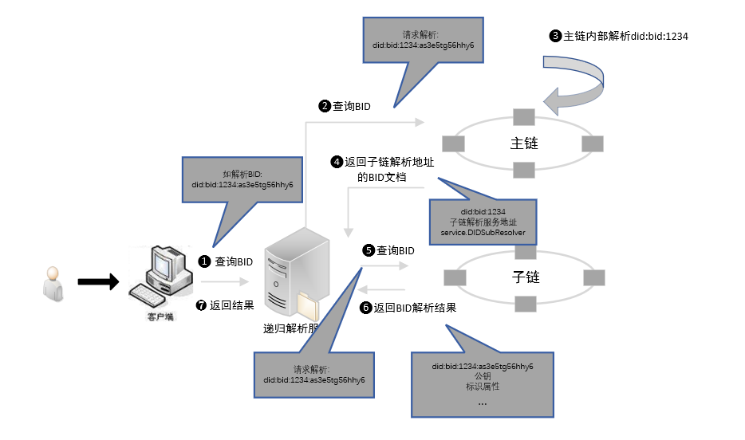

具体递归解析流程如下：

1.  用户通过BID递归解析服务查询`did:bid:1234:as3e5tg56hhy6`

2.  递归解析到主链解析`did:bid:1234:as3e5tg56hhy6`
3.  主链内部解析did:bid:1234的BID文档，包含AC号为1234的子链的解析地址
4.  递归解析到子链解析`did:bid:1234:as3e5tg56hhy6`
5.  子链解析服务返回`did:bid:1234:as3e5tg56hhy6`在子链解析服务上的BID文档
6.  递归解析系统将解析结果返回给用户

#### 4.2.3.2 可信解析

​        可信解析主要是对BID文档的公钥和签名内容进行可信验证，遵循DPKI规范，在整个星火链网内存在多个为普通BID,文档publickKey签名认证的认证BID,保证数据来源的可靠性，确保递归解析过程中每个经过的解析服务都是可信的。BID递归解析系统需要实现此接口，在递归解析的过程中，确保中间解析服务地址没有被篡改。

**1. 可信签名流程**

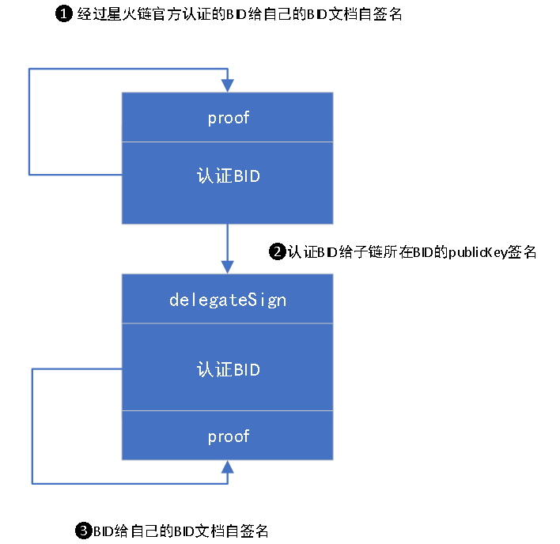

**2. 可信解析流程**


**3. 可信解析接口**

**接口名称**：BID可信解析接口(GET方法)

**接口说明**：根据BID解析BID内容

**接口地址**：[http://\${url}/\${bid}?verify=true](http://\${url}/\${bid}?verify=true)，url为解析服务的地址，bid为要解析的BID

**成功返回参数：**

| 字段名       | 类型   | 说明                             |
|--------------|--------|----------------------------------|
| errorCode    | int    | 见响应码说明                     |
| data         | Object | 解析结果                         |
| data.version | String | BID解析协议的版本，本版本为1.0.0 |
| data.verify  | Bool   | true                             |
| …            |        | 其他字段同BID解析                |

**失败返回参数：**

| 字段名    | 类型   | 说明         |
|-----------|--------|--------------|
| errorCode | int    | 见响应码说明 |
| message   | String | 失败原因     |

**失败返回示例：**

```json
{
	"errorCode": 6,
	"message": "not found"
}
```

### 4.2.4 响应码说明

| 返回码                             | 返回码解释       |
|------------------------------------|------------------|
| 0 (success)                        | 对一次成功的解析 |
| 1(without permission)              | 无权限           |
| 2 (error)                          | 发生错误         |
| 3 (server too busy)                | 服务器繁忙       |
| 4 (protocol error)                 | 协议错误         |
| 5 (operation not supported)        | 不支持的操作     |
| 6 (not found)                      | 没有找到标识     |
| 7 (server not response)            | 服务器没有响应   |
| 8 （field not found）              | 不存在的字段     |
| 9 （verify failed）                | 签名验证失败     |
| 10 （nonexistent chain code info） | 不存在AC号信息   |

## 4.3 二进制解析协议

本次只支持文本解析协议，二进制解析协议会在后续的版本中加入，敬请期待。

# 5. 签名算法

## 5.1 约束条件

   要序列化的bid数据(尤其是extension字段)必须适用于JSON [[RFC7493](https://www.rfc-editor.org/rfc/rfc8785#RFC7493)]格式，这意味着以下内容：

-   JSON 对象不得显示重复的属性名称。
-   JSON 字符串数据必须可以表示为 Unicode [[UNICODE](https://www.rfc-editor.org/rfc/rfc8785#UNICODE)]。
    
-   JSON 数字数据必须可以表示为 IEEE 754 [[IEEE754](https://www.rfc-editor.org/rfc/rfc8785#IEEE754)]
    双精度值。对于需要比 IEEE 754 双精度提供更高精度或更长整数的应用程序，建议将此类数字表示为 JSON 字符串；

## 5.2 签名规则

- 基本数据类型处理

  字面量、字符串和数字序列化特殊处理，需要满足I-JSON[[RFC8785](https://www.rfc-editor.org/rfc/rfc8785#name-serialization-of-primitive-)]的要求。

- 排序

  - 排序。需要排序的对象数据依据属性key值转换为UTF-16的字节单元，字节单元的首字节进行简单的值比较来进行升序排序。如果首字节相同，则继续对后面的字节进行比对，直到产生不同大小的值来进行升序排列。
  - 递归。对所有的子对象数据也需要进行递归排序。
  - 数组。要求数组元素顺决不能被改变。

- 数据压缩

  去掉JSON符号间的空白，紧凑化处理。

- 签名

  对排序压缩后的字节数据使用签名算法进行签名。

- Base58编码

  签名数据进行Base58编码生成signatureValue字符串。

## 5.3 签名步骤

1.  将需要签名的凭证或者BID文档数据，去掉proof数据后按照规则进行排序。

2.  压缩处理排序后的数据形成待签名字节数据（UTF-8字符集）。

3.  使用私钥对待签名字节数据进行签名

4.  对签名数据进行Base58编码，生成signatureValue数据

## 5.4 示例

### 5.4.1 凭证签名

**源数据：**

```json
{
	"issuer": "did:bid:efJgt44mNDewKK1VEN454R17cjso3mSG",
	"issuanceDate": "2021-01-20T12:01:20Z",
	"effectiveDate": "2021-01-20T12:01:20Z",
	"expirationDate": "2021-04-02T12:01:20Z",
	"revocationId": "did:bid:efJgt44mNDewKK1VEN454R17cjso3mSG#revocation",
	"credentialSubject": {
		"id": "did:bid:efJgt44mNDewKK1VEN454R17cjso3mSG",
		"type": 202,
		"name": "asc",
		"content": {
			"registerCapital": "1000.0",
			"status": "2"
		}
	},
	"proof": [{
		"creator": "did:bid:ef18F9AVK4SQLZPRrPkrVWwp9kbpdXHx#key-1",
		"signatureValue": "4TWzvxXDgejyWK7syUeg68WFd6Kf5cGV8bnEYR35UaKX18VRwemnnBuuGkMHGrSP2qbDac9WwhTffLQhyzz2Vp5m"
	}]
}
```

#### 5.4.1.1 排序

```json
{
	"credentialSubject": {
		"content": {
			"registerCapital": "1000.0",
			"status": "2"
		},
		"id": "did:bid:efJgt44mNDewKK1VEN454R17cjso3mSG",
		"name": "asc",
		"type": 202
	},
	"effectiveDate": "2021-01-20T12:01:20Z",
	"expirationDate": "2021-04-02T12:01:20Z",
	"issuanceDate": "2021-01-20T12:01:20Z",
	"issuer": "did:bid:efJgt44mNDewKK1VEN454R17cjso3mSG",
	"revocationId": "did:bid:efJgt44mNDewKK1VEN454R17cjso3mSG#revocation"
}
```

#### 5.4.1.2 签名

​        使用测试私钥priSPKp8oiiAXGZaXFBMKEAoL2b6J6UDQCw4x39ereXYtyAejM，运用Ed25519算法计算待签名字节数据(排序后的数据转为字节)并Base58编码。

```
4TWzvxXDgejyWK7syUeg68WFd6Kf5cGV8bnEYR35UaKX18VRwemnnBuuGkMHGrSP2qbDac9WwhTffLQhyzz2Vp5m
```

### 5.4.2 BID文档签名

**源数据：**

```json
{
	"@context": ["https://w3.org/ns/did/v1"],
	"id": "did:bid:ef18F9AVK4SQLZPRrPkrVWwp9kbpdXHx",
	"created": "2021-06-24T09:10:09Z",
	"updated": "2021-06-24T09:10:09Z",
	"extension": {
		"recovery": ["did:bid:ef18F9AVK4SQLZPRrPkrVWwp9kbpdXHx#key-1"],
		"attributes": [{
			"key": "contract",
			"encrypt": 1,
			"format": "text",
			"desc": "contract address",
			"value": "did:bid:efJgt44mNDewKK1VEN454R17cjso3mSG"
		}],
		"ttl": 86400,
		"type": 105
	},
	"authentication": ["did:bid:ef18F9AVK4SQLZPRrPkrVWwp9kbpdXHx#key-1"],
	"publicKey": [{
		"controller": "did:bid:ef18F9AVK4SQLZPRrPkrVWwp9kbpdXHx",
		"id": "did:bid:ef18F9AVK4SQLZPRrPkrVWwp9kbpdXHx#key-1",
		"publicKeyHex": "b06566f76733ae048fda721d47afe8780b572636496c93253db86dc8d5427fc54e9a06",
		"type": "Ed25519"
	}],
	"proof": {
		"creator": "did:bid:ef18F9AVK4SQLZPRrPkrVWwp9kbpdXHx #key-1",
		"signatureValue": " 5jFX6UKMVTg73LCWamNdeZACCMftMjSrJvZpL86ULefr3216SKRfgH6YkrmHT5DACYSpVEeN9RcnNES8cAHBVsMw"
	},
	"version": "1.1.0"
}
```

#### 5.4.2.1 排序

```json
{
	"@context": ["https://w3.org/ns/did/v1"],
	"authentication": ["did:bid:ef18F9AVK4SQLZPRrPkrVWwp9kbpdXHx#key-1"],
	"created": "2021-06-24T09:10:09Z",
	"extension": {
		"attributes": [{
			"desc": "contract address",
			"encrypt": 1,
			"format": "text",
			"key": "contract",
			"value": "did:bid:efJgt44mNDewKK1VEN454R17cjso3mSG"
		}],
		"recovery": ["did:bid:ef18F9AVK4SQLZPRrPkrVWwp9kbpdXHx#key-1"],
		"ttl": 86400,
		"type": 105
	},
	"id": "did:bid:ef18F9AVK4SQLZPRrPkrVWwp9kbpdXHx",
	"publicKey": [{
		"controller": "did:bid:ef18F9AVK4SQLZPRrPkrVWwp9kbpdXHx",
		"id": "did:bid:ef18F9AVK4SQLZPRrPkrVWwp9kbpdXHx#key-1",
		"publicKeyHex": "b06566f76733ae048fda721d47afe8780b572636496c93253db86dc8d5427fc54e9a06",
		"type": "Ed25519"
	}],
	"updated": "2021-06-24T09:10:09Z",
	"version": "1.1.0"
}
```

#### 5.4.2.2 签名

​         使用测试私钥priSPKp8oiiAXGZaXFBMKEAoL2b6J6UDQCw4x39ereXYtyAejM，运用Ed2519算法计算待签名字节数据(排序后的数据转为字节)并Base58编码。

```
5jFX6UKMVTg73LCWamNdeZACCMftMjSrJvZpL86ULefr3216SKRfgH6YkrmHT5DACYSpVEeN9RcnNES8cAHBVsMw 
```

# 6. 应用场景示例

## 6.1 分布式数字身份认证

​        车管所、交管局等在星火链上有自己的身份信息BID，用户购买车以后也会在星火链上注册汽车的身份信息BID，车管所、交管局等给汽车颁发允许其上路正常行驶所需的凭证，汽车将凭证也上传到星火链上。汽车上路的时候，监控拍摄到汽车的BID，通过BID递归解析到汽车的凭证，再通过BID递归解析到颁发凭证的车管所、交管局的数字身份信息，从而验证汽车的凭据的有效性，实现智能设备的交互。

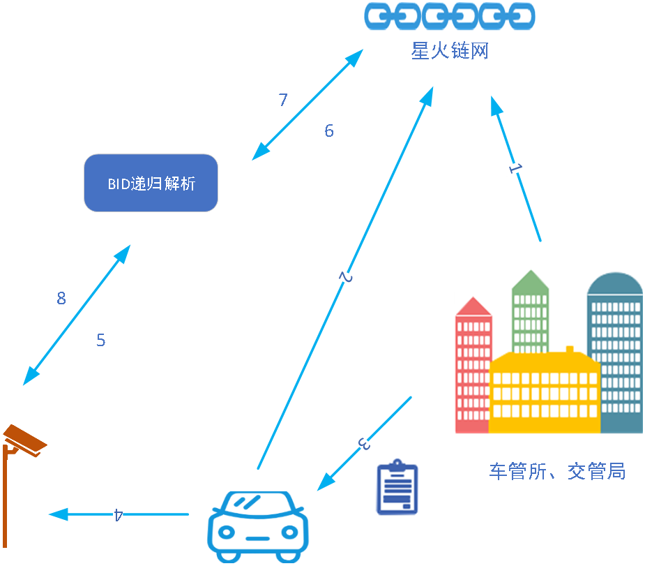

1.  车管所、交管局在星火链网注册自己的数字身份

2.  用户购买汽车后在星火链网注册自己的数字身份

3.  车管所、交管局给汽车办法电子凭证

4.  汽车在路上行驶时探头扫描汽车的电子凭证

5.  探头通过递归解析到星火链网解析车管所、交管局的数字身份

6.  探头通过车管所、交管局的数字身份验证汽车的电子凭证


## 6.2 分布式解析实现一物一码溯源

​         同一私钥控制的同一产品的BID标识,在主链和不同子链上都有不同的信息，在主链上存储着不同子链AC号对应的地址，在子链上存储着具体产品信息，用户通过BID解析器解析该BID,通过BID递归内部的递归和分布式解析，最终给用户返回产品的完整信息。

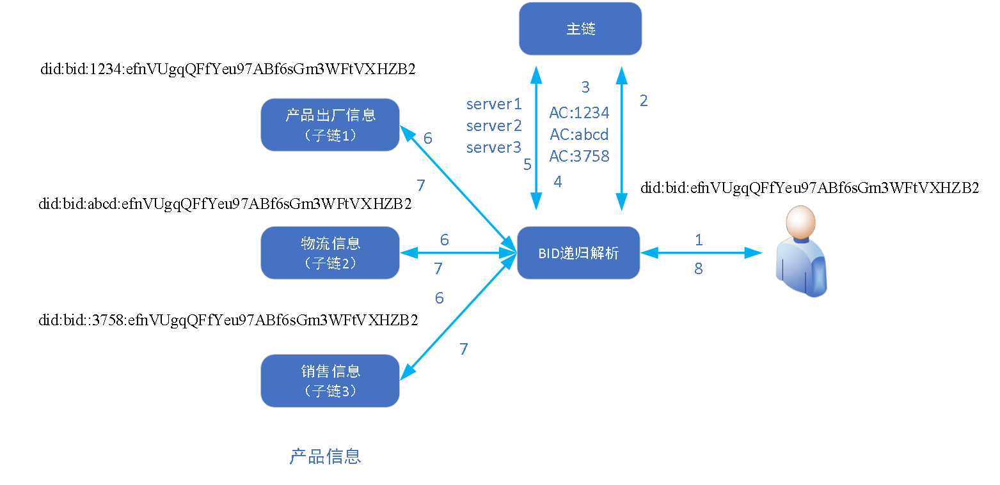

1.  用户通过BID递归解析服务解析BID did:bid:efnVUgqQFfYeu97ABf6sGm3WFtVXHZB2

2.  递归解析到主链解析did:bid:efnVUgqQFfYeu97ABf6sGm3WFtVXHZB2

3.  主链返回did:bid:efnVUgqQFfYeu97ABf6sGm3WFtVXHZB2所在的子链AC号列表和子链所属的BID

4.  递归解析到主链解析子链的地址

5.  主链返回该子链的地址

6.  递归解析到各子链解析带有AC号的BID

7.  各子链返回该BID在子链上的信息

8.  递归汇总解析结构后返回给用户

# 附录一 类型码表

**1. 关联标识类型**

| **类型码** | **描述** |
|------------|----------|
| 101        | BID      |
| 102        | 其他DID  |
| 103        | 域名     |
| 104        | Zid      |
| 105        | handle   |
| …          | 待扩展   |

**2. 属性类型**

| **类型码** | **描述** |
| ---------- | -------- |
| 101        | 人       |
| 102        | 企业     |
| 103        | 节点     |
| 104        | 智能设备 |
| 105        | 智能合约 |
| 201        | 图片     |
| 202        | 视频     |
| 203        | 文档     |
| 204        | 资源数据 |
| 205        | 凭证     |
| 206        | AC号     |
| 999        | 其他     |

**3. 凭证类型**

| 取值 | 类型      |
|------|-----------|
| 201  | 可信认证  |
| 202  | 学历认证  |
| 203  | 资质认证  |
| 204  | 授权认证  |
| …    | 待扩展    |

**4. 服务类型**

| 类型           | 描述         |
|----------------|--------------|
| DIDDecrypt     | 加解密服务   |
| DIDStorage     | 存储服务     |
| DIDRevocation  | 凭证吊销服务 |
| DIDResolver    | 解析服务     |
| DIDSubResolver | 子链解析服务 |
| …              | 待扩展       |

**5. 解析服务协议类型**

| 取值 | 对应的协议 |
|------|------------|
| 0    | UDP        |
| 1    | TCP        |
| 2    | HTTP       |
| 3    | HTTPS      |
